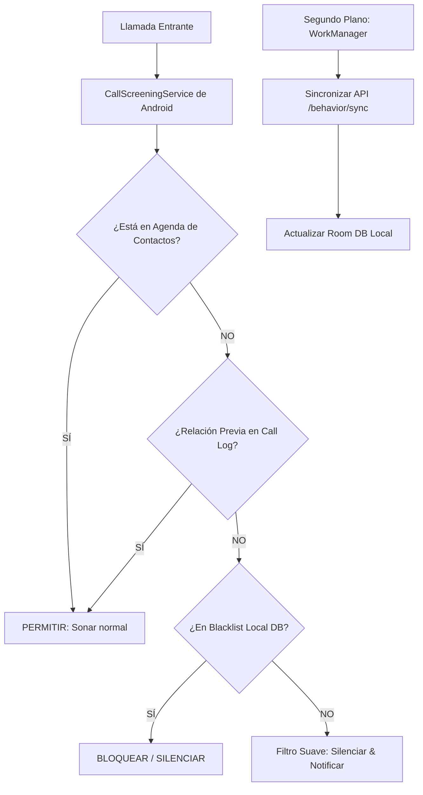

# Especificación de Integración para Android: Motor de Filtrado Local de Patova

Esta especificación técnica detalla la arquitectura de integración y el algoritmo local de decisión de llamadas para el equipo de desarrollo móvil de Android de **Patova**. 

---

## 1. Arquitectura General (Offline-First)

Para asegurar la privacidad del usuario, evitar problemas de latencia de red en llamadas entrantes, y ahorrar batería, **Patova implementa una arquitectura Offline-First**.



---

## 2. Permisos Requeridos en `AndroidManifest.xml`

Para que el algoritmo funcione con precisión equilibrada, la aplicación de Android debe declarar y solicitar en tiempo de ejecución los siguientes permisos críticos:

```xml
<!-- Permisos de llamadas e identidad telefónica -->
<uses-permission android:name="android.permission.ANSWER_PHONE_CALLS" />
<uses-permission android:name="android.permission.READ_PHONE_STATE" />
<uses-permission android:name="android.permission.READ_CALL_LOG" />

<!-- Permiso para la lista blanca dinámica -->
<uses-permission android:name="android.permission.READ_CONTACTS" />

<!-- Para sincronizar en segundo plano de manera estable -->
<uses-permission android:name="android.permission.INTERNET" />
<uses-permission android:name="android.permission.RECEIVE_BOOT_COMPLETED" />
```

> [!IMPORTANT]
> A partir de Android 10 (API 29), el bloqueo no debe realizarse con `BroadcastReceiver` invasivos. Se debe solicitar al usuario que configure a **Patova como la aplicación predeterminada de Filtrado de Llamadas** mediante el `RoleManager` solicitando el rol `RoleManager.ROLE_CALL_SCREENING`.

---

## 3. El Algoritmo de Decisión de Llamadas (Paso a Paso)

Cuando entra una llamada, el método `onScreenCall` de nuestro `CallScreeningService` se ejecuta de forma asíncrona. La decisión debe tomarse en menos de **100ms** siguiendo estrictamente estos filtros:

### Paso 1: Agenda de Contactos
*   **Acción:** Consultar en el `ContactsContract` si el número entrante (`incomingNumber`) existe.
*   **Decisión:** Si el número existe en la agenda, **Permitir de inmediato**.

### Paso 2: Historial de Relación Real (`Call Log`)
*   **Acción:** Consultar el proveedor de contenidos `CallLog.Calls` en busca de llamadas con ese número en los últimos 60 días.
*   **Filtros de Seguridad:**
    1.  **Llamadas Salientes:** Si el usuario inició al menos una llamada saliente (`CallLog.Calls.OUTGOING_TYPE`) a ese número $\rightarrow$ **Permitir**.
    2.  **Llamadas Entrantes Contestadas:** Si el usuario recibió llamadas entrantes de ese número y la duración de la conversación fue mayor a **8 segundos** (`CallLog.Calls.DURATION > 8`) $\rightarrow$ **Permitir**.
*   *Razón:* Esto garantiza que los repartidores de apps de comida habituales, médicos o locales comerciales que el usuario interactúa frecuentemente queden exentos de cualquier tipo de silenciamiento de forma automática.

### Paso 3: Consulta en la Base de Datos Local (Room DB)
*   **Acción:** Buscar el hash SHA-256 del número en la tabla local de `BlacklistEntry` y verificar su `spam_score`.
*   **Decisión:** 
    *   Si está en la base de datos de spam con score de bloqueo $\rightarrow$ **Bloquear Duro** (Rechazar llamada de forma silenciosa).

### Paso 4: El Filtro de Primer Contacto (Desconocido Absoluto)
*   Si la llamada supera los pasos 1, 2 y 3 (es un número desconocido absoluto sin reportes ni relación):
*   **Acción:** Aplicar **Filtro Suave (Silenciado Inteligente)**:
    1.  Silenciar la llamada (no vibra, no suena el timbre).
    2.  Lanzar una notificación sutil flotante en tiempo real: *"Llamada silenciada por Patova. Toca para contestar"*.
    3.  **Filtro de Emergencia (Doble Llamada):** Si el mismo número realiza una segunda llamada en un lapso menor a **5 minutos**, el algoritmo se salta el filtro suave y **hace sonar la llamada** por si fuera una urgencia real.

---

## 4. Estructura de Endpoints del Backend (API FastAPI)

El equipo de Android deberá interactuar con los siguientes endpoints del backend FastAPI ya disponibles en el servidor:

### 1. Sincronización Incremental (`POST /api/v1/behavior/sync`)
Lanzado periódicamente por el `WorkManager` (ej. cada 24 horas, idealmente de noche cuando el dispositivo está en Wi-Fi y cargando). Envia cambios locales (números que el usuario bloqueó/desbloqueó manualmente) y recupera únicamente los cambios globales desde la última sincronización.

*   **Request (`SyncRequest`):**
    ```json
    {
      "user_id": "uuid-del-usuario-suscripto",
      "client_last_sync_timestamp": "2026-05-23T12:00:00Z",
      "local_changes": {
        "preferences": {
          "strict_mode": false,
          "block_unknown": false,
          "spam_threshold": 0.75,
          "sync_enabled": true,
          "updated_at": "2026-05-23T15:00:00Z"
        },
        "new_whitelist_entries": [
          {
            "phone_hash": "sha256-hex-hash-del-numero",
            "label": "Mi Delivery Habitual",
            "added_at": "2026-05-23T14:30:00Z"
          }
        ],
        "new_blacklist_entries": []
      }
    }
    ```
*   **Response (`SyncResponse`):**
    ```json
    {
      "sync_timestamp": "2026-05-23T19:00:00Z",
      "sync_status": "SUCCESS",
      "canonical_preferences": {
        "strict_mode": false,
        "block_unknown": false,
        "spam_threshold": 0.75,
        "sync_enabled": true,
        "updated_at": "2026-05-23T19:00:00Z"
      },
      "whitelist_delta": [],
      "blacklist_delta": [
        {
          "phone_hash": "a4d3f56...",
          "reason": "HIGH_REPORT_VOLUME",
          "added_at": "2026-05-23T18:00:00Z"
        }
      ]
    }
    ```

### 2. Reporte Pasivo de Robocall (`POST /api/v1/report`)
Si una llamada desconocida y silenciada es cortada por el emisor antes de 5 segundos sin ser atendida, el `WorkManager` móvil envía este reporte en segundo plano sin interrumpir al usuario.

*   **Request (`ReportRequest`):**
    ```json
    {
      "number": "+5491112345678",
      "device_id": "android-uuid-unico-del-dispositivo",
      "report_type": "ROBOCALL",
      "description": "Llamada fantasma de un tono (silenciada)",
      "call_duration_sec": 3,
      "call_time": "2026-05-23T15:58:00Z"
    }
    ```

### 3. Reporte de Falso Positivo (`POST /api/v1/feedback`)
Si la app silenció una llamada de reparto por error y el usuario pulsa **"No era Spam"** en la notificación o panel:

*   **Request (`FeedbackRequest`):**
    ```json
    {
      "number": "+5491198765432",
      "device_id": "android-uuid-unico-del-dispositivo",
      "feedback_type": "FALSE_POSITIVE",
      "related_verdict": "BLOCK",
      "timestamp": "2026-05-23T16:00:00Z"
    }
    ```
    *   *Nota del Servidor:* Al recibir este evento de `FALSE_POSITIVE`, el backend deduce automáticamente **20 puntos del score de spam** para que el número del repartidor/médico vuelva a ser clasificado como limpio globalmente si varios usuarios lo corrigen.

---

## 5. Código Kotlin de Referencia (CallScreeningService)

A continuación, se provee el código de referencia en Kotlin que implementa la estructura exacta de nuestro flujo de decisión inteligente:

```kotlin
package agency.serra.patova.services

import android.net.Uri
import android.provider.CallLog
import android.provider.ContactsContract
import android.telecom.Call
import android.telecom.CallScreeningService
import android.util.Log

class PatovaCallScreeningService : CallScreeningService() {

    override fun onScreenCall(callDetails: Call.Details) {
        val rawNumber = callDetails.handle.schemeSpecificPart
        Log.d("Patova", "Evaluando llamada entrante: $rawNumber")

        // Paso 1: Comprobar Agenda de Contactos
        if (isNumberInContacts(rawNumber)) {
            Log.i("Patova", "Número en contactos. Permitido.")
            respondToCall(callDetails, allow = true, silence = false)
            return
        }

        // Paso 2: Comprobar relación previa en el Call Log
        if (hasRecentRelationship(rawNumber)) {
            Log.i("Patova", "Relación recíproca o llamada previa exitosa detectada. Permitido.")
            respondToCall(callDetails, allow = true, silence = false)
            return
        }

        // Paso 3: Comprobar base de datos local (Room)
        val isLocalSpam = checkLocalDatabaseForSpam(rawNumber)
        if (isLocalSpam) {
            Log.w("Patova", "Spam Confirmado localmente. BLOQUEADO.")
            respondToCall(callDetails, allow = false, silence = false) // Bloqueo duro
            return
        }

        // Paso 4: Desconocido sin reportes -> Silenciado inteligente (Filtro Suave)
        Log.i("Patova", "Número desconocido absoluto. Silenciando y alertando de forma suave.")
        respondToCall(callDetails, allow = true, silence = true)
        
        // Disparar UI de banner flotante o notificación interactiva
        showSmartNotification(rawNumber)
    }

    private fun isNumberInContacts(phoneNumber: String): Boolean {
        val uri = Uri.withAppendedPath(
            ContactsContract.PhoneLookup.CONTENT_FILTER_URI, 
            Uri.encode(phoneNumber)
        )
        val projection = arrayOf(ContactsContract.PhoneLookup.DISPLAY_NAME)
        contentResolver.query(uri, projection, null, null, null)?.use { cursor ->
            if (cursor.moveToFirst()) return true
        }
        return false
    }

    private fun hasRecentRelationship(phoneNumber: String): Boolean {
        val uri = CallLog.Calls.CONTENT_URI
        val selection = "${CallLog.Calls.NUMBER} = ? AND (${CallLog.Calls.TYPE} = ? OR (${CallLog.Calls.TYPE} = ? AND ${CallLog.Calls.DURATION} > 8))"
        val selectionArgs = arrayOf(
            phoneNumber, 
            CallLog.Calls.OUTGOING_TYPE.toString(), 
            CallLog.Calls.INCOMING_TYPE.toString()
        )
        
        contentResolver.query(uri, null, selection, selectionArgs, null)?.use { cursor ->
            if (cursor.count > 0) return true
        }
        return false
    }

    private fun checkLocalDatabaseForSpam(phoneNumber: String): Boolean {
        // Consultar el Room DB local
        // val db = PatovaDatabase.getInstance(applicationContext)
        // return db.blacklistDao().exists(hashNumber(phoneNumber))
        return false 
    }

    private fun respondToCall(callDetails: Call.Details, allow: Boolean, silence: Boolean) {
        val response = CallResponse.Builder().apply {
            setDisallowCall(!allow)
            setRejectCall(!allow)
            setSkipCallLog(false)
            setSkipNotification(silence)
            setSilenceCall(silence)
        }.build()
        respondToCall(callDetails, response)
    }

    private fun showSmartNotification(phoneNumber: String) {
        // Enviar un Broadcast o llamar al NotificationManager para pintar el banner
        // con los botones: [Atender] y [Falso Positivo]
    }
}
```

---

## 6. Recomendaciones Técnicas de Implementación

1.  **Detección de Caídas de Llamadas Cortas (Robocall pasivo):** 
    En el `PhoneStateListener` o mediante `TelephonyManager`, monitorear la transición de estados `RINGING` $\rightarrow$ `IDLE`. Si la llamada pasa a `IDLE` en menos de 5 segundos de timbrado sin haber sido contestada, registrar el evento de `ROBOCALL` y mandarlo encolado al `WorkManager` para reportar a la API.
2.  **Seguridad y Privacidad:** 
    Nunca enviar números de teléfono planos en la sincronización general. Siempre convertir a SHA-256 (`phone_hash`) en el cliente móvil antes de enviarlos en el body de `/sync` para cumplir con las estrictas regulaciones de privacidad de la Google Play Store.
