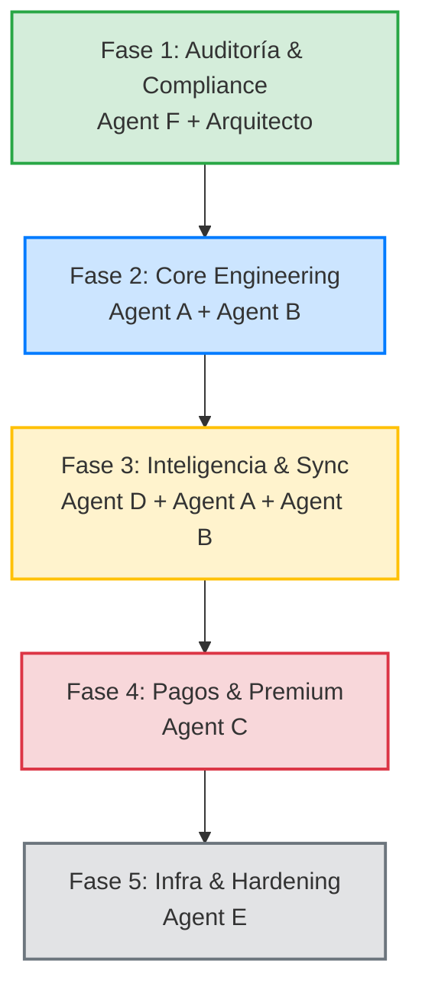

# NumGuard / Patova — Plan de Orquestación Multi-Agente
Este plan de orquestación establece las reglas, contratos, responsabilidades, estrategias de branching y tareas específicas para cada uno de los **6 Agentes Especializados** que intervienen en la evolución del MVP de NumGuard / Patova a producción. 

El objetivo primordial de esta metodología es evitar que el crecimiento exponencial del contexto y el acoplamiento técnico degraden la calidad, rompan contratos de APIs o violen políticas críticas de la Google Play Store.

---

## 🏗️ 1. Estructura de Roles y Orquestación

### 👑 Arquitecto Principal (Solo Planificación / Auditoría)
Este agente **NO escribe código**. Es el encargado de la consistencia conceptual e integradora del sistema.
* **Responsabilidades:**
  1. Validar propuestas de refactorización y contratos de APIs antes de que los agentes comiencen a codear.
  2. Revisa Pull Requests (PRs) de todos los agentes asegurando que no violen los contratos definidos.
  3. Controlar la deuda técnica agregada y la consistencia de estilos.
  4. Garantizar el cumplimiento estricto de las políticas de Google Play Store (*Play Store Compliance*).
* **Documento Maestro:** Utiliza el [MasterPlanFinal.md](file:///c:/Users/Lauta/OneDrive/Escritorio/patova/android/app/docs/MasterPlanFinal.md) y este plan de orquestación como única fuente de verdad.

---

## 📈 2. Roadmap por Fases de Ejecución

Para mantener la estabilidad del sistema, se prohíbe trabajar en todas las áreas en paralelo. Se utilizará un pipeline estructurado en **5 Fases**:



---

## 🌿 3. Estrategia de Branching y Aislamiento de Código

Para evitar conflictos y "romper" código ajeno, cada agente trabajará en ramas estrictamente aisladas bajo el siguiente esquema:

| Agente | Nombre del Agente | Rama de Trabajo | Directorio Scope |
| :--- | :--- | :--- | :--- |
| **Arquitecto** | Principal Orchestrator | `main` | Todo el repositorio (Solo lectura/Validación) |
| **Agente A** | Backend Core | `feature/backend-core` | `[backend/](file:///c:/Users/Lauta/OneDrive/Escritorio/patova/backend)` (No toca `android`) |
| **Agente B** | Android Core | `feature/android-core` | `[android/](file:///c:/Users/Lauta/OneDrive/Escritorio/patova/android)` (No toca `backend`) |
| **Agente C** | Payments Specialist | `feature/payments` | `backend/src/numguard/services/mp/` & `android/app/src/.../ui/premium/` |
| **Agente D** | Anti-SPAM Intelligence | `feature/spam-intel` | `backend/src/numguard/services/scoring/` & `android/.../domain/rules/` |
| **Agente E** | Infra / DevOps | `feature/infra-devops` | `[infra/](file:///c:/Users/Lauta/OneDrive/Escritorio/patova/infra)` & `.github/workflows/` |
| **Agente F** | Play Store Compliance | `feature/play-compliance` | `android/app/src/main/AndroidManifest.xml` & Legales |

### Reglas de Integración de Código (PRs):
1. **Congelamiento de Contratos (Phase 1):** Ningún agente de desarrollo puede modificar endpoints ni bases de datos hasta que el Arquitecto apruebe las firmas.
2. **Revisión Obligatoria:** Un PR no puede integrarse a `main` si rompe los tests de integración o unitarios del otro lado.
3. **Mocks:** El Agente B (Android) debe usar datos mockeados basados estrictamente en los esquemas JSON de este documento hasta que el Agente A (Backend) tenga listos los endpoints.

---

## 📜 4. Contratos de API Estables (Interfaces Congeladas)

Los siguientes esquemas JSON representan el **contrato de comunicación** inmutable entre el backend (FastAPI) y el cliente Android (Room/Retrofit).

### Contrato 1: Score y Reputación (`GET /api/v1/spam/reputation/{phone_hash}`)
Manejado por **Agente D** (Spam Intel) y consumido por **Agente B** (Android).
```json
{
  "phone_hash": "e3b0c44298fc1c149afbf4c8996fb92427ae41e4649b934ca495991b7852b855",
  "reputation_score": 0.82,
  "reputation_state": "SUSPICIOUS",
  "total_reports": 24,
  "unique_reporters": 18,
  "confidence": 0.91,
  "explainability": {
    "heuristic_flags": ["HIGH_CALL_FREQUENCY_BURST", "TEMPORARY_NUMBER_PATTERN"],
    "community_severity": "HIGH",
    "description": "Reportado frecuentemente como telemarketing en las últimas 2 horas con llamadas de alta frecuencia."
  },
  "last_seen": "2026-05-18T01:30:00Z"
}
```

### Contrato 2: Reporte de Spam Comunitario (`POST /api/v1/spam/report`)
Enviado por **Agente B** (Android) y procesado por **Agente A** / **Agente D** (Backend).
```json
{
  "phone_hash": "e3b0c44298fc1c149afbf4c8996fb92427ae41e4649b934ca495991b7852b855",
  "reason": "SPAM_TELEMARKETING",
  "severity": "HIGH",
  "call_duration_seconds": 3,
  "timestamp": "2026-05-18T01:35:00Z",
  "reporter_metadata": {
    "app_version": "1.0.4",
    "os_version": "Android 13",
    "local_rules_triggered": ["BURST_CALL_PATTERN"]
  }
}
```

### Contrato 3: Sincronización Incremental de Preferencias (`POST /api/v1/behavior/sync`)
Sincronización bidireccional incremental entre Room y PostgreSQL.
* **Request Payload:**
```json
{
  "client_last_sync_timestamp": "2026-05-18T00:00:00Z",
  "local_changes": {
    "preferences": {
      "strict_mode": true,
      "block_unknown": false,
      "spam_threshold": 0.75,
      "sync_enabled": true,
      "updated_at": "2026-05-18T01:20:00Z"
    },
    "new_whitelist_entries": [
      { "phone_hash": "a1b2c3d4...", "label": "Familia", "added_at": "2026-05-18T01:10:00Z" }
    ],
    "new_blacklist_entries": [
      { "phone_hash": "f9e8d7c6...", "reason": "Molesto", "added_at": "2026-05-18T01:15:00Z" }
    ]
  }
}
```
* **Response Payload (Canonical State):**
```json
{
  "sync_timestamp": "2026-05-18T01:40:00Z",
  "sync_status": "SUCCESS",
  "canonical_preferences": {
    "strict_mode": true,
    "block_unknown": false,
    "spam_threshold": 0.75,
    "sync_enabled": true,
    "updated_at": "2026-05-18T01:20:00Z"
  },
  "whitelist_delta": [],
  "blacklist_delta": [
    { "phone_hash": "z9y8x7w6...", "reason": "Global Block", "added_at": "2026-05-17T23:50:00Z" }
  ]
}
```

---

## 📋 5. Subplanes Detallados de Agentes (Fase por Fase)

---

### FASE 1 — AUDITORÍA TÉCNICA, COMPLIANCE Y ARQUITECTURA
> [!IMPORTANT]
> **Fase Crítica de Bloqueo.** Ningún agente puede escribir código funcional hasta que esta fase esté completada para salvaguardar la cuenta de Google Play Store.

#### Agente F — Play Store Compliance
* **Objetivo:** Auditar y reformar la app Android para cumplir al 100% las estrictas directivas de Google sobre apps de telefonía/Call Screening.
* **Scope Técnico:** Manifests, Foreground Services, Consent Flow UI, Legales.
* **Tareas Específicas:**
  1. **Auditoría de Manifest y Permisos:** Analizar [AndroidManifest.xml](file:///c:/Users/Lauta/OneDrive/Escritorio/patova/android/app/src/main/AndroidManifest.xml) para justificar los permisos `READ_CALL_LOG`, `READ_CONTACTS`, `ANSWER_PHONE_CALLS`, `READ_PHONE_STATE` y `ROLE_CALL_SCREENING`. Eliminar cualquier permiso redundante.
  2. **Diseño de Pantalla de Consentimiento Explicito (Prominent Disclosure Screen):** Diseñar e implementar el flujo previo a solicitar permisos en Jetpack Compose ([ar.com.numguard.ui.disclosure](file:///c:/Users/Lauta/OneDrive/Escritorio/patova/android/app/src/main/java/ar/com/numguard/ui/disclosure/DisclosureScreen.kt)). Debe detallar claramente qué datos se recolectan (hashes de teléfonos), cómo se analizan y que NUNCA se venden.
  3. **Migración de Foreground Services:** Validar que los Foreground Services requeridos para la intercepción/Call Screening en Android 13+ y 14 especifiquen el `foregroundServiceType` correcto en el Manifest.
  4. **Preparación de "Data Safety" y Políticas:** Escribir el borrador del documento de Privacidad y Data Safety (`android/app/docs/DataSafetyDraft.md`) para subir a la consola de Google.
* **Definición de DONE (Agent F):**
  - Cero warnings de lint en compilación por permisos de Android.
  - El flujo de onboarding exige y explica de forma premium y clara cada permiso sensible antes de pedir el diálogo nativo.
  - Archivo de políticas completado.

---

### FASE 2 — INGENIERÍA DE CORE (BACKEND & ANDROID)
> [!NOTE]
> Esta fase construye los cimientos estables del flujo de datos. Backend y Android se comunican mediante contratos pre-aprobados.

#### Agente A — Backend Core
* **Objetivo:** Reforzar la arquitectura FastAPI, implementar las migraciones de base de datos base y optimizar el sistema de cache en Redis.
* **Scope Técnico:** FastAPI, SQLAlchemy 2, Alembic, PostgreSQL, Redis, Cache invalidation.
* **Tareas Específicas:**
  1. **Migraciones con Alembic:** Crear y aplicar las migraciones para las tablas base `user_preferences`, `whitelist_entries`, `blacklist_entries` (`backend/alembic/versions/`).
  2. **Configuración de Caché en Redis:** Diseñar la estrategia de cacheo de reputación de números en [core/cache.py](file:///c:/Users/Lauta/OneDrive/Escritorio/patova/backend/src/numguard/core/cache.py). Implementar invalidación por patrón de eventos (ej. cuando se reporta un nuevo spam).
  3. **Implementación de Rate Limiting:** Configurar rate-limiting por API Key y por IP utilizando Redis en todos los endpoints públicos para evitar scraping masivo de reputación de teléfonos.
  4. **Robustez de Endpoints Base:** Refactorizar [main.py](file:///c:/Users/Lauta/OneDrive/Escritorio/patova/backend/src/numguard/main.py) y routers para incluir control de timeouts estricto, logging estructurado (JSON logger) y middleware para manejo global de excepciones.
* **Definición de DONE (Agent A):**
  - Migraciones ejecutadas exitosamente sin pérdida de consistencia.
  - Tests unitarios y de integración de endpoints base con cobertura mínima del 85%.
  - Integración de Redis testeada con escenarios de caída/reconexión automática (resilience).

#### Agente B — Android Core
* **Objetivo:** Robustecer la UI del usuario, la persistencia local de configuración y la integración base de la llamada.
* **Scope Técnico:** Jetpack Compose, Room DB, Local Preferences, CallScreeningService.
* **Tareas Específicas:**
  1. **Arquitectura de Base de Datos Local:** Implementar la base de datos Room y DAOs para `LocalPreferencesEntity`, `WhitelistEntity` y `BlacklistEntity` en [ar.com.numguard.data.local](file:///c:/Users/Lauta/OneDrive/Escritorio/patova/android/app/src/main/java/ar/com/numguard/data/local).
  2. **Refactorización de UI de Configuración (Settings Screen):** Crear una interfaz premium e interactiva en Jetpack Compose en `ar.com.numguard.ui.settings.SettingsScreen` que permita al usuario configurar el nivel de filtrado (Strict, Block Unknown, Silent Spam) y gestionar su Whitelist/Blacklist.
  3. **Servicio de Call Screening Base:** Enlazar el [CallScreeningService](file:///c:/Users/Lauta/OneDrive/Escritorio/patova/android/app/src/main/java/ar/com/numguard/screening/NumGuardCallScreeningService.kt) para leer de la base de datos Room local y tomar decisiones instantáneas offline en < 150ms.
  4. **Encrypted Storage:** Migrar tokens de sesión y configuraciones críticas a `EncryptedSharedPreferences` / Jetpack DataStore con cifrado.
* **Definición de DONE (Agent B):**
  - Configuración guardada localmente de forma instantánea.
  - Pantalla de settings responsiva, con animaciones premium y soporte completo de Dark Mode.
  - Room DB testeada mediante tests de unidad instrumentados.

---

### FASE 3 — INTELIGENCIA ANTI-SPAM Y MOTOR DE SINCRONIZACIÓN
> [!TIP]
> Aquí se implementa la lógica híbrida: decisiones locales robustas y agregación inteligente en la nube.

#### Agente D — Anti-SPAM Intelligence
* **Objetivo:** Crear el motor heurístico local (Android) y el Reputation Engine centralizado (Backend).
* **Scope Técnico:** Algoritmos de scoring, heurísticas, agregación, explainability.
* **Tareas Específicas:**
  1. **Reputation Scoring Service (Backend):** Programar en [services/scoring.py](file:///c:/Users/Lauta/OneDrive/Escritorio/patova/backend/src/numguard/services/scoring.py) la fórmula matemática de score global que calcula confianza basándose en: total de reportes comunitarios, reporteros únicos y severidad de los motivos de reporte.
  2. **Heurísticas Locales (Android):** Crear un `LocalHeuristicsEngine` en `ar.com.numguard.domain.heuristics` que evalúe patrones sospechosos sin internet (ej: llamadas repetidas de números similares en ráfagas de tiempo, prefijos no registrados).
  3. **Explicabilidad del Score:** Generar un payload de respuesta enriquecido que describa el porqué de un bloqueo (Explainability block) para mostrarlo al usuario en la UI de historial.
  4. **Filtros Antifraude y Ponderación:** Diseñar heurísticas de backend para evitar reportes falsos masivos (sybil attacks) penalizando reportes de usuarios con baja reputación de reporte o con IP duplicadas.
* **Definición de DONE (Agent D):**
  - Algoritmo de scoring verificado con tests que simulan ataques de reporte masivo y demuestran resiliencia.
  - El motor local toma decisiones heurísticas de forma aislada en menos de 50ms.

#### Agente A & B — Sync Engine & Worker Task (Colaborativo)
* **Objetivo:** Sincronizar el estado offline del teléfono con la nube de forma segura y eficiente.
* **Agente A (Backend Tasks):**
  - Implementar el endpoint incremental `POST /api/v1/behavior/sync`.
  - Crear la lógica de resolución de conflictos en `services/sync.py`: última escritura gana (timestamp merges) para preferencias, y unión de conjuntos sin duplicados para listas de bloqueo.
* **Agente B (Android Tasks):**
  - Implementar un `SyncWorker` heredando de `CoroutineWorker` con Jetpack WorkManager en `ar.com.numguard.sync.SyncWorker`.
  - Configurar condiciones del Worker: ejecutarse solo en Wi-Fi, con batería cargada y el dispositivo en idle (o programado cada 6 horas).
  - Manejo de backoff exponencial ante caídas del servidor.
* **Definición de DONE (Sync Engine):**
  - Desconexión simulada durante la edición de listas y posterior sincronización exitosa al reconectar, sin duplicar registros.

---

### FASE 4 — SISTEMA DE PAGOS AISLADO Y PREMIUM UX
> [!CAUTION]
> Toda la validación de suscripciones premium se procesa en el backend. Nunca confiar exclusivamente en el estado de la aplicación en el dispositivo local.

#### Agente C — Payments Specialist
* **Objetivo:** Integrar Mercado Pago para suscripciones mensuales recurrentes, procesar Webhooks y diseñar la experiencia premium en la app.
* **Scope Técnico:** Mercado Pago SDK, Webhooks idempotentes, State Machine de suscripciones, Paywall UI.
* **Tareas Específicas:**
  1. **Creación de Preferencias MP (Backend):** Implementar `POST /api/v1/payments/create-preference` en `backend/src/numguard/services/mp/` configurando los planes de pago y metadatos del usuario.
  2. **Webhook Receiver Idempotente:** Diseñar el endpoint `POST /api/v1/payments/webhook/mp`. Guardar firmas de eventos para prevenir ataques de replay. Consultar directamente el API oficial de Mercado Pago para re-verificar el estado del pago antes de activar el premium en base de datos.
  3. **Manejo de Estados de Suscripción:** Definir la máquina de estados de suscripción (`ACTIVE`, `PENDING`, `EXPIRED`, `FRAUD_REVIEW`) y persistirla en la tabla `subscriptions`.
  4. **Diseño de Paywall Premium (Android):** Crear en Jetpack Compose una UI premium para el Paywall en `ar.com.numguard.ui.premium.PaywallScreen`, con efectos visuales atractivos (glassmorphism/gradientes), tabla de features gratis vs premium, y botón de suscripción que abra el checkout de Mercado Pago de forma segura.
  5. **Premium Cache Offline:** Implementar un mecanismo local seguro en Android para almacenar el estado premium encriptado para que la app mantenga las features habilitadas sin internet por un máximo de 7 días antes de requerir re-validación con el servidor.
* **Definición de DONE (Agent C):**
  - Flujo de checkout de Mercado Pago funcionando de extremo a extremo en entorno Sandbox.
  - Webhook de pago procesado de forma asíncrona mediante colas de background.
  - La app deshabilita las features premium al instante si el webhook reporta una suscripción `EXPIRED` o `CANCELED`.

---

### FASE 5 — DEVOPS, HARDENING Y VERIFICACIÓN
> [!NOTE]
> Fase enfocada en la robustez operativa, escalabilidad, monitoreo y CI/CD automatizado para producción.

#### Agente E — Infra / DevOps
* **Objetivo:** Securizar los contenedores Docker, establecer pipelines automáticos, monitorear la salud del sistema y preparar backups automáticos.
* **Scope Técnico:** Docker Multi-stage, GitHub Actions, Prometheus, Grafana, Nginx, PostgreSQL Backups.
* **Tareas Específicas:**
  1. **Docker Hardening:** Modificar todos los Dockerfiles de `backend/` y services para implementar builds multi-stage. Configurar los contenedores para ejecutarse como usuarios no-root (`USER appuser`) y agregar `HEALTHCHECK` nativo.
  2. **CI/CD Pipelines:** Escribir los archivos yaml de GitHub Actions en `.github/workflows/`:
     - `backend-ci.yml`: Ejecuta linters, analiza vulnerabilidades (bandit/safety) y corre tests unitarios con reporte de coverage.
     - `android-ci.yml`: Ejecuta ktlint, corre tests de Room, compila y firma el bundle `.aab` de staging.
  3. **Observabilidad Avanzada:** Configurar agentes de Prometheus en el backend FastAPI y preparar un dashboard en Grafana (`infra/grafana/dashboards/`) que exponga: tiempo de respuesta de API, llamadas bloqueadas/permitidas, tasa de error 5xx, consumo de memoria de Redis/Postgres y volumen de hits de webhooks.
  4. **Automatización de Backups y Secretos:** Crear un cron-job seguro para backups diarios de PostgreSQL cifrados en almacenamiento externo y configurar el gestor de secretos de producción (dotenv o bóveda de secretos en cloud).
* **Definición de DONE (Agent E):**
  - Pipeline de CI/CD pasa exitosamente al pushear a `main`.
  - Nivel de seguridad del contenedor Docker califica A+ (sin vulnerabilidades críticas).
  - Dashboards de monitoreo operativos y visualizando datos simulados en tiempo real.

---

## 🛡️ 6. Definición Global de DONE (Criterios de Aceptación del Arquitecto)

Cada rama de agente que sea integrada a `main` por el Arquitecto debe cumplir con los siguientes estándares:

1. **Compilación Limpia:** Cero errores de compilación tanto en backend (Python/Pyproject) como en Android (Kotlin/Gradle).
2. **Cobertura de Tests:** Cobertura de tests unitarios superior al **80%** en todo el nuevo código aportado.
3. **Validación de Políticas:** Los cambios de Android no pueden incluir permisos peligrosos sin su correspondiente flujo de consentimiento explícito aprobado por Agent F.
4. **Manejo de Errores Estricto:** Toda llamada de red o transacción de base de datos debe envolverse en bloques de reintento/captura con fallbacks elegantes para no arruinar la experiencia del usuario (crashes cero).
5. **Legibilidad y Comentarios:** Todo código complejo debe estar debidamente documentado mediante comentarios explicativos y tipos estáticos (Pydantic en Backend y tipado fuerte en Kotlin).
