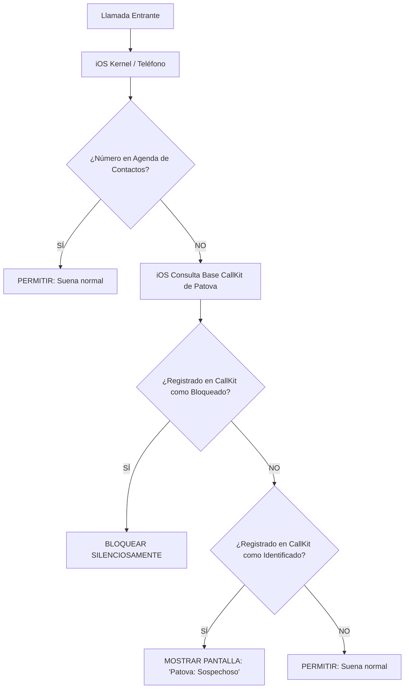

# Especificación de Integración para iOS: Motor de Filtrado CallKit de Patova

Esta especificación técnica detalla la arquitectura de integración y el algoritmo local de identificación y bloqueo de llamadas para el desarrollo de la aplicación móvil de iOS de **Patova**, adaptándolo a las estrictas políticas de sandbox de Apple de la forma más similar posible a la versión de Android.

---

## 1. La Diferencia Crucial: Android vs. iOS (Sandbox de Apple)

A diferencia de Android (donde el servicio `CallScreeningService` se ejecuta dinámicamente en tiempo real ante cada llamada entrante y puede leer el historial de llamadas), **iOS no permite ejecutar código dinámico en segundo plano durante una llamada entrante por motivos de privacidad.** 

En iOS:
*   **No existe acceso al Historial de Llamadas (`Call Log`):** Apple prohíbe que las aplicaciones de la App Store lean las llamadas entrantes o salientes del usuario. Por ende, la regla del historial del algoritmo de Android no puede aplicarse en iOS.
*   **Modelo de Base de Datos Pre-Cargada (CallKit):** La app de Patova debe descargar previamente la lista negra y lista blanca de nuestro backend y **escribirla en una base de datos del sistema operativo iOS**. Cuando entra una llamada, es el propio sistema operativo iOS el que realiza la búsqueda de forma privada en esa base de datos precargada y decide si bloquea o identifica el número.



---

## 2. Solución en iOS: Call Directory Extension (CallKit)

Para lograr el mismo nivel de efectividad que en Android, implementaremos una **Call Directory Extension** de **CallKit** (`CXCallDirectoryProvider`).

### Algoritmo Adaptado para iOS:
1.  **Contactos del Usuario:** iOS automáticamente permite que suenen todas las llamadas de la agenda de contactos. CallKit solo actúa sobre números desconocidos.
2.  **Sincronización en la App Principal (Background Fetch / Push Notifications):**
    *   La aplicación principal de iOS se despierta en segundo plano (utilizando notificaciones push silenciosas o tareas de fondo de `BackgroundTasks`).
    *   Llama a nuestro endpoint `/api/v1/behavior/sync` enviando el timestamp del último sync.
    *   Descarga la lista de deltas de spam.
    *   Guarda los números convertidos en hashes telefónicos o números directos formateados (formato `E.164` sin el signo `+` requerido por CallKit, por ejemplo `5491112345678`).
3.  **Recarga de CallKit:**
    *   La app principal le solicita al sistema operativo regenerar el directorio de bloqueo llamando a:
        `CXCallDirectoryManager.sharedInstance.reloadExtension(withIdentifier: "...")`
    *   Esto activa nuestra extensión de CallKit, la cual lee la base de datos local y le pasa la lista estructurada de números a iOS.

---

## 3. Comportamientos de Bloqueo vs. Identificación en iOS

Dado que no podemos hacer un "silenciado suave con banner flotante" en tiempo real como en Android, logramos el **equilibrio perfecto** dividiendo los números en dos categorías dentro de CallKit:

1.  **Bloqueo Absoluto (`Blocking Entry`):**
    *   Se aplica a números con `spam_score >= 0.75` (Spam confirmado globalmente o añadidos a la lista negra personal del usuario).
    *   **Resultado en iOS:** El teléfono rechaza la llamada de inmediato de forma totalmente silenciosa. El spammer va directo a buzón de voz y el usuario no se entera.
2.  **Identificación de Llamada (`Identification Entry`):**
    *   Se aplica a números con `spam_score` entre `0.21` y `0.74` (Números sospechosos, encuestas, cobradores telefónicos habituales, etc.).
    *   **Resultado en iOS:** El teléfono suena de manera normal, pero debajo del número en la pantalla de llamada entrante nativa de iOS aparece la etiqueta personalizada de Patova, por ejemplo:
        *   `Patova: Cobranzas`
        *   `Patova: Telemarketing Sospechoso`
        *   `Patova: Posible Spam`
    *   *Ventaja:* Esto permite que si llama un repartidor de Mercado Libre cuyo número fue reportado como dudoso, el usuario vea `"Patova: Reparto/Mensajería"` en pantalla y decida atender voluntariamente, sin que se le bloquee la llamada por completo.

---

## 4. Código Swift de Referencia (Call Directory Extension)

Aquí tenés el código de referencia en **Swift** que debe implementar el agente de iOS para crear la extensión del sistema:

### Archivo: `CallDirectoryHandler.swift`

```swift
import Foundation
import CallKit

class CallDirectoryHandler: CXCallDirectoryProvider {

    override func beginRequest(with context: CXCallDirectoryExtensionContext) {
        context.delegate = self

        // 1. Agregar números bloqueados (Spam Confirmado)
        // Nota: Los números deben ser mayores a cero y estar ordenados ascendentemente.
        if !addAllBlockingPhoneNumbers(to: context) {
            context.cancelRequest(withError: NSError(domain: "PatovaCallDirectoryHandler", code: 1, userInfo: nil))
            return
        }

        // 2. Agregar números de identificación (Sospechosos / Reparto)
        // Nota: Los números deben estar ordenados ascendentemente.
        if !addAllIdentificationPhoneNumbers(to: context) {
            context.cancelRequest(withError: NSError(domain: "PatovaCallDirectoryHandler", code: 2, userInfo: nil))
            return
        }

        context.completeRequest()
    }

    private func addAllBlockingPhoneNumbers(to context: CXCallDirectoryExtensionContext) -> Bool {
        // Obtenemos los números de spam bloqueados de nuestra base de datos compartida (App Group)
        // IMPORTANTE: Deben estar en formato numérico puro sin el "+" (ej: 5491112345678)
        // y ordenados de forma ascendente estricta.
        let blockedNumbers: [CXCallDirectoryPhoneNumber] = getBlockedNumbersFromSharedDatabase()
        
        for number in blockedNumbers {
            context.addBlockingEntry(withNextSequentialPhoneNumber: number)
        }
        
        return true
    }

    private func addAllIdentificationPhoneNumbers(to context: CXCallDirectoryExtensionContext) -> Bool {
        // Obtenemos los números sospechosos y sus etiquetas correspondientes.
        // Deben estar ordenados ascendentemente por número telefónico.
        let suspectNumbers: [CXCallDirectoryPhoneNumber] = getSuspectNumbersFromSharedDatabase()
        let labels: [String] = getLabelsForSuspectNumbers() // ej: "Patova: Telemarketing", "Patova: Reparto"
        
        for (index, number) in suspectNumbers.enumerated() {
            let label = labels[index]
            context.addIdentificationEntry(withNextSequentialPhoneNumber: number, label: label)
        }
        
        return true
    }
    
    // Métodos auxiliares para consultar SQLite / CoreData local compartida en el App Group
    private func getBlockedNumbersFromSharedDatabase() -> [CXCallDirectoryPhoneNumber] {
        // Implementación de lectura local de la base de datos sincronizada
        return [5491199999999, 5491188888888].sorted() // Ejemplo semilla ordenado
    }
    
    private func getSuspectNumbersFromSharedDatabase() -> [CXCallDirectoryPhoneNumber] {
        return [5491177777777].sorted() // Ejemplo semilla
    }
    
    private func getLabelsForSuspectNumbers() -> [String] {
        return ["Patova: Posible Spam"]
    }
}

extension CallDirectoryHandler: CXCallDirectoryExtensionContextDelegate {
    func requestFailed(for extensionContext: CXCallDirectoryExtensionContext, withError error: Error) {
        // Registrar error en logs
        NSLog("Patova Call Directory Extension falló: \(error.localizedDescription)")
    }
}
```

---

## 5. Activación Requerida por el Usuario en iOS

Debido a la estricta seguridad de iOS, para que el bloqueo y la identificación de llamadas de Patova comiencen a funcionar, el usuario debe habilitar manualmente la extensión en la configuración del sistema.

La app de iOS debe guiar visualmente al usuario para realizar esta acción:
1.  Abrir la aplicación **Ajustes** de iOS.
2.  Ir al menú de **Teléfono**.
3.  Entrar a **Bloqueo e ident. de llamadas**.
4.  Activar el interruptor (switch) de **Patova**.

### Verificar estado desde la App en Swift:
Podemos verificar si el usuario tiene el permiso activado y mostrar un cartel de advertencia si no lo hizo:

```swift
CXCallDirectoryManager.sharedInstance.getEnabledStatusForExtension(withIdentifier: "com.patova.app.patova.CallDirectory") { status, error in
    if let error = error {
        print("Error verificando estado: \(error)")
        return
    }
    
    switch status {
    case .enabled:
        print("Patova Call Directory está ACTIVO")
    case .disabled:
        print("Patova está inactivo. Mostrar pantalla de tutorial.")
    case .unknown:
        print("Estado desconocido")
    @unknown default:
        break
    }
}
```

---

## 6. Recomendaciones Técnicas de Desarrollo para iOS

1.  **App Groups (Contenedor Compartido):** La aplicación principal (`Main App`) y la extensión de Call Directory (`App Extension`) corren en procesos aislados. Deben activar **App Groups** en Xcode Capabilities para poder compartir la misma base de datos local (CoreData / SQLite) donde se almacenan las listas negras sincronizadas de la API.
2.  **Límite de memoria en CallKit:** La extensión de CallKit tiene un límite de memoria estricto de **16MB** en iOS al ejecutarse. No debés hacer llamadas de red ni cálculos pesados dentro de `CallDirectoryHandler`. Todo el trabajo de parseo e indexación debe hacerlo la app principal, de modo que la extensión solo tenga que leer y pasar la lista de números pre-calculada de forma súper liviana.
3.  **Orden Ascendente:** Es el requisito más crítico de CallKit. Si un solo número de teléfono de la lista de bloqueo o identificación no está ordenado de menor a mayor (`549111...` < `549112...`), CallKit crasheará y no bloqueará nada. Sorteá siempre los arrays antes de ingresarlos.
